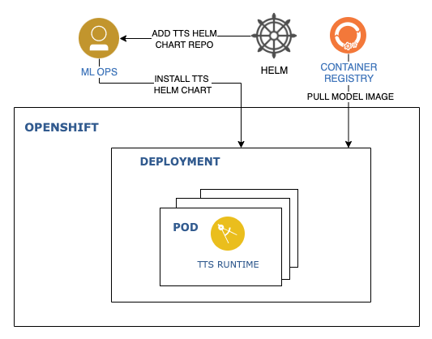

# Deploy TTS Runtime in OpenShift/Kubernetes

IBM Watson® Text to Speech (TTS) enables you to convert written text into natural-sounding audio in a variety of languages and voices within an existing application or within Watson Assistant.

This tutorial walks you through the steps install a TTS Runtime service in OpenShift. We will use [this](https://github.com/IBM/ibm-watson-embed-charts/tree/main/charts/ibm-watson-tts-embed) helm chart to deploy the service. You may use classic Kubernetes cluster to complete this tutorial as well.

## Reference Architecture



## Prerequisites

- Install [Helm 3](https://helm.sh/docs/intro/install/).
- Ensure you have an [entitlement key](https://myibm.ibm.com/products-services/containerlibrary). You may need to create one. This key is required to access [images](https://www.ibm.com/docs/en/watson-libraries?topic=i-accessing-files) used in this tutorial.
- Set an environment variable.

  ```sh
  export IBM_ENTITLEMENT_KEY=<Set the entitlement key>
  ```
- An OpenShift Cluster on which you will deploy the service.
  
## Install Text to Speetch helm chart

Clone the Helm chart Github repository.

```sh
git clone https://github.com/IBM/ibm-watson-embed-charts.git
cd ibm-watson-embed-charts/charts
```

The containers deployed by this chart come from the IBM Entitled Registry. You must create a Secret with credentials to pull from this registry. The default name is `ibm-entitlement-key`, but this can be changed by updating the value of `imagePullSecrets`.

An example command to create the pull secret:

```sh
 oc create secret docker-registry ibm-entitlement-key \
  --docker-server=cp.icr.io \
  --docker-username=cp \
  --docker-password=$IBM_ENTITLEMENT_KEY \
  --docker-email=<your-email>
```

> By default, the models that are enabled are en-US_MichaelV3Voice and en-US_AllisonV3Voice with defaultModel set to en-US_AllisonV3Voice.

Helm charts have configurable values that can be set at install time. To configure the install further, such as enabling additional models, Refer to the base values.yaml for documentation and defaults for the values. Values can be changed using `--set` or using YAML files specified with `-f/--values`. Here we are setting values using `--set` parameter

```sh
helm install tts-release ./ibm-watson-tts-embed-runtime \
--set license=true \
--set nameOverride=tts \
--set models.enUSTelephony.enabled=false 
```

## Verifying the chart

See the instruction (from NOTES.txt within chart) after the Helm installation completes for chart verification. The instruction can also be viewed by running the following command.

```sh
helm status tts-release
```

For basic usage of customization, see the customizing Watson Speech Library for Embed [documentation](https://www.ibm.com/docs/en/watson-libraries?topic=containers-customization-example).

The complete API reference for Watson Text-to-Speech can be found [here](https://cloud.ibm.com/apidocs/text-to-speech).


## Use the service

In one terminal, create a proxy through the service:

```sh
oc proxy
```

In another terminal, view the list of voices:

```sh

curl --url "http://localhost:8001/api/v1/namespaces/stt-demo/services/https:tts-release-runtime:https/proxy/text-to-speech/api/v1/voices"
```

Send a /synthesize request to generate speech and write out output.wav:

```sh
curl --url "http://localhost:8001/api/v1/namespaces/stt-demo/services/https:tts-release-runtime:https/proxy/text-to-speech/api/v1/recognize?model=en-US_AllisonV3Voice" \
      --header "Content-Type: application/json" \
      --data '{"text":"Hello world"}' \
      --header "Accept: audio/wav" \
      --output output.wav
```

## Uninstalling the Chart

To uninstall and delete the Text to Speech deployment, run the following command:

```sh

helm delete tts-release
```
